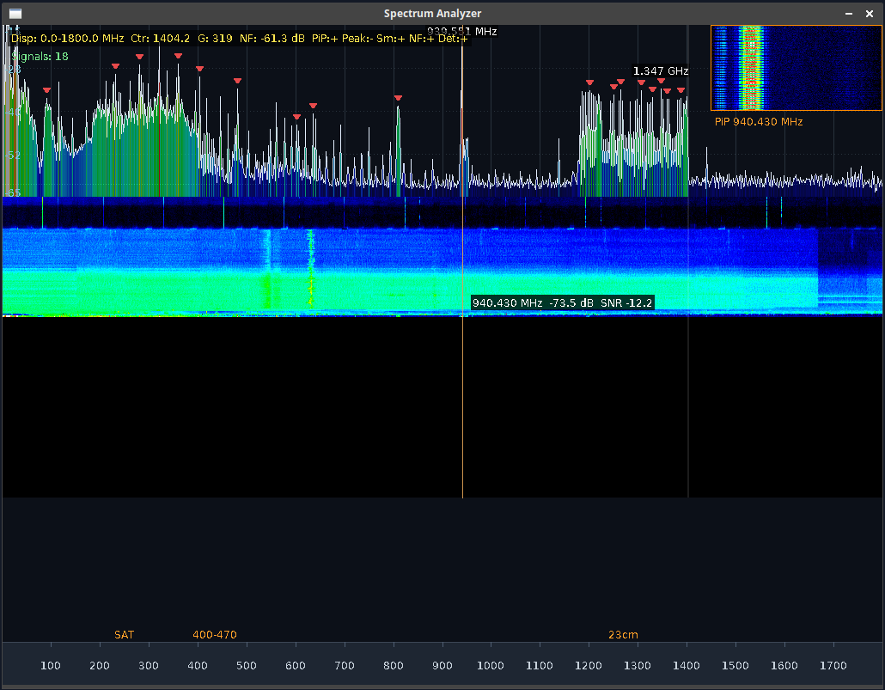

# Compile

```sh
g++ -O3 -march=native -ffast-math -std=c++23 -o freqmon main.cpp -lrtlsdr -lkissfft-float -lpthread -lliquid -fpermissive -lSDL2 -lSDL2_ttf -I/usr/local/lib/librtlsdr/local/include -L/usr/local/lib/librtlsdr/local/lib -Wl,-rpath,/usr/local/lib/librtlsdr/local/lib
```

# Run

```sh
LD_LIBRARY_PATH=/usr/local/lib/librtlsdr/local/lib ./freqmon 
```
